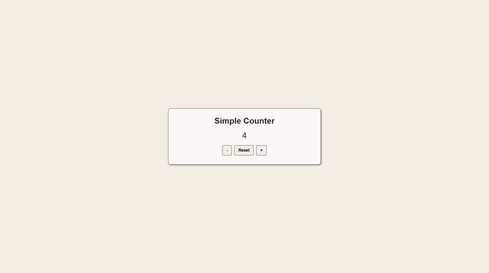

# React Counter
A minimal React counter application built with Vite.
This project demonstrates the basic structure of a React application, including component rendering, state management using React hooks, and running the application through a local development server.



## Overview
This project implements a simple interactive counter with three controls:

- Increase the counter value
- Decrease the counter value
- Reset the counter to zero

The interface is styled using plain CSS and centered on the page. The counter logic is implemented using the `useState` hook from React.

## Tech Stack
- React
- React DOM
- Vite
- JavaScript (ES Modules)
- CSS

## Features
- Functional React component
- State management with `useState`
- Simple and clean UI
- CSS styling
- Fast development server using Vite

## Project Structure
```text
react-counter
├── index.html
├── package.json
├── package-lock.json
├── vite.config.js
├── screenshot.jpg
└── src/
    ├── index.jsx
    └── styles.css
```

## Requirements
Before running this project, ensure the following software is installed:

- Node.js
- npm (comes with Node.js)

You can verify installation by running:

```bash
npm -v  
node -v
```

## Installation
1. Clone the repository:

```bash
git clone https://github.com/dmitry-backend/react-counter.git
```

2. Navigate to the project directory:

```bash
cd react-counter
```

3. Install project dependencies:

```bash
npm install
```

This installs all dependencies defined in package.json.

## Running the Development Server
Start the local development server using:

```bash
npm run dev
```

Vite will start a development server and provide a local URL similar to:

`http://localhost:5173`

Open this URL in your browser to view the application.

During development, Vite automatically reloads the page when changes are made to the source files.

## License
This project is licensed under the MIT License.